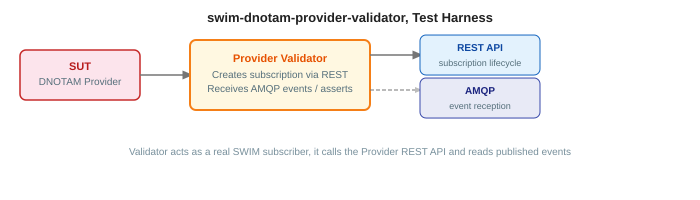

# swim-dnotam-provider-validator

Interactive test harness for validating DNOTAM Provider implementations. Acts as a consumer workstation, authenticates via Keycloak, manages subscriptions through the provider's REST API, connects to the provider's AMQP broker, captures messages, and displays received DNOTAM events on an interactive Europe map.



## What it does

- **Keycloak authentication**, OAuth2/OIDC login with JWT token inspection
- **mTLS proxy**, backend proxy for secure communication with the provider REST API
- **Subscription management**, create, activate, pause, and delete subscriptions via the provider
- **AMQP message capture**, connects to the provider's broker, consumes DNOTAM events per user session
- **Event visualization**, SVG-based Europe map with event markers extracted from AIXM coordinates
- **Conformance testing**, automated test scenarios against the provider's SPEC-170 API
- **Real-time console**, Server-Sent Events (SSE) stream for live operation feedback
- **Message persistence**, MariaDB storage for received events with XML viewer

---

## GET STARTED

### Prerequisites

- Java 21
- Maven 3.9+
- Podman (or any OCI-compatible runtime with Compose support)
- A running DNOTAM Provider (`swim-dnotam-provider`)
- TLS certificates (generate with [swim-developer-tools](https://github.com/swim-developer/swim-developer-tools))
- Shared modules installed in local Maven repo (see below)

### 0. Install shared modules

This project depends on shared modules from [swim-developer-validators](https://github.com/swim-developer/swim-developer-validators). They must be installed in your local Maven repository before building or running this project.

Clone and install once:

```bash
git clone git@github.com:swim-developer/swim-developer-validators.git
cd swim-developer-validators
./mvnw clean install -DskipTests
```

You only need to repeat this step when `swim-developer-validators` is updated.

### 1. Start the infrastructure

```bash
podman compose up -d
```

Services started:

| Service | Port | Description |
|---------|------|-------------|
| `dnotam-provider-validator-mariadb` | 3308 | Validator persistence |

### 2. Run the validator

```bash
./mvnw quarkus:dev
```

Configure the following environment variables (or set them in `application-dev.properties`) to point at your running provider instance:

```properties
SWIM_PROVIDER_API_URLS=https://localhost:8443
SWIM_PROVIDER_AMQP_HOST=localhost
SWIM_PROVIDER_AMQP_PORT=5671
KEYCLOAK_URL=https://localhost:8543
```

- UI: http://localhost:8080/ui
- Swagger UI: http://localhost:8080/swagger-ui

### Keycloak users

All users belong to the `swim` realm. Password for every user is `password`.

| Username | Email | AMQ Broker roles |
|----------|-------|-----------------|
| `marcelo` | masales@redhat.com | `marcelo-swim-dnotam-v1-amq-role`, `marcelo-swim-ed254-v1-amq-role`, `admin` |
| `daniel` | daniel@swim.local | `daniel-swim-dnotam-v1-amq-role`, `daniel-swim-ed254-v1-amq-role` |
| `ansp1` | ansp1@swim.local | `ansp1-swim-dnotam-v1-amq-role`, `ansp1-swim-ed254-v1-amq-role` |
| `ansp2` | ansp2@swim.local | `ansp2-swim-dnotam-v1-amq-role`, `ansp2-swim-ed254-v1-amq-role` |
| `aisp1` | aisp1@swim.local | `aisp1-swim-dnotam-v1-amq-role`, `aisp1-swim-ed254-v1-amq-role` |

Each user receives DNOTAM events on their own dedicated queue (`DNOTAM-{username}-*`).

### Verify, happy path

With the provider running and this validator pointing at it:

```bash
# Validator status (should show mTLS and provider connection details)
curl -s http://localhost:8080/api/status | jq .

# The validator is working correctly when:
# - /api/status shows the provider API URL and connection status
# - Opening http://localhost:8080/ui shows the Dashboard with the authentication button
# - Clicking "Login" redirects to Keycloak and returns a JWT token
# - In the AMQP page, connecting to the provider's broker shows active queues
# - After creating a subscription in the Provider API page and
#   injecting an event via the provider's internal API,
#   the Messages page shows the received DNOTAM event
```

---

## UI

| Page | Path | Description |
|------|------|-------------|
| Dashboard | `/ui` | Overview and authentication status |
| Provider API | `/ui/api` | Subscription management interface |
| Token | `/ui/token` | JWT token inspection and refresh |
| Console | `/ui/console` | Real-time operation logs (SSE) |
| AMQP | `/ui/amqp` | Broker connection and queue management |
| Messages | `/ui/messages` | Received DNOTAM events list |
| Subscriptions | `/ui/subscriptions` | Active subscription management |

---

## REST API

| Method | Endpoint | Description |
|--------|----------|-------------|
| `GET` | `/api/config/keycloak` | Keycloak configuration for frontend |
| `GET` | `/api/config/provider` | Provider API URLs |
| `GET` | `/api/status` | mTLS and connection status |
| `GET` | `/api/console/stream` | SSE stream for console events |
| `GET` | `/api/user/messages` | User's received messages |
| `GET` | `/api/messages/{id}/xml` | Formatted XML view |
| `GET` | `/api/messages/{id}/download` | Download AIXM XML file |
| `POST` | `/api/events/inject` | Inject test DNOTAM event |
| `GET` | `/api/map/events` | SVG map with event markers |

---

## Environment variables

| Variable | Default | Description |
|----------|---------|-------------|
| `KEYCLOAK_URL` | `https://rhbk.apps.ocp4.masales.cloud` | Keycloak server URL |
| `KEYCLOAK_REALM` | `swim` | Keycloak realm name |
| `KEYCLOAK_CLIENT_ID` | `swim-public-client` | OAuth2 client ID |
| `SWIM_PROVIDER_API_URLS` |: | Comma-separated provider REST API URLs |
| `SWIM_PROVIDER_AMQP_HOST` |: | Provider's AMQP broker hostname |
| `SWIM_PROVIDER_AMQP_PORT` | `443` | Provider's AMQP broker port |
| `PROXY_MTLS_KEYSTORE_PATH` | `certs/keystore.p12` | Client certificate keystore |
| `PROXY_MTLS_KEYSTORE_PASSWORD` | `changeit` | Keystore password |
| `PROXY_MTLS_KEYSTORE_TYPE` | `PKCS12` | Keystore type |
| `PROXY_MTLS_TRUSTSTORE_PATH` | `certs/truststore.p12` | Trust store for CA certificates |
| `PROXY_MTLS_TRUSTSTORE_PASSWORD` | `changeit` | Truststore password |
| `PROXY_MTLS_TRUSTSTORE_TYPE` | `PKCS12` | Truststore type |
| `MARIADB_HOST` | `localhost` | MariaDB hostname |
| `MARIADB_PORT` | `3306` | MariaDB port |
| `MARIADB_DATABASE` | `swim_client` | Database name |
| `MARIADB_USERNAME` | `swim` | Database username |
| `MARIADB_PASSWORD` | `swim` | Database password |

---

## Container images

```
quay.io/masales/swim-dnotam-provider-validator:latest
```

---

## Build

Run from this project's root directory. Requires [swim-developer-validators](https://github.com/swim-developer/swim-developer-validators) installed in local Maven repo (see step 0 above).

```bash
make jvm              # JVM multi-arch image (amd64 + arm64), build + push

make native-amd64     # Native amd64 image — run on an amd64 machine (e.g. Fedora)
make native-arm64     # Native arm64 image — run on an arm64 machine (e.g. Mac M1)
make manifest         # Create multi-arch manifest from both registry images
make push             # Push manifest to registry
make native           # Full native sequence: amd64 + arm64 + manifest + push
```

Override registry or tag: `make native-amd64 REGISTRY=quay.io/myorg TAG=v1.2.3`

---

## Deployment

Includes a Helm chart under `src/main/helm/` with CRC and production values.

---

## License

Licensed under the [Apache License 2.0](LICENSE).
